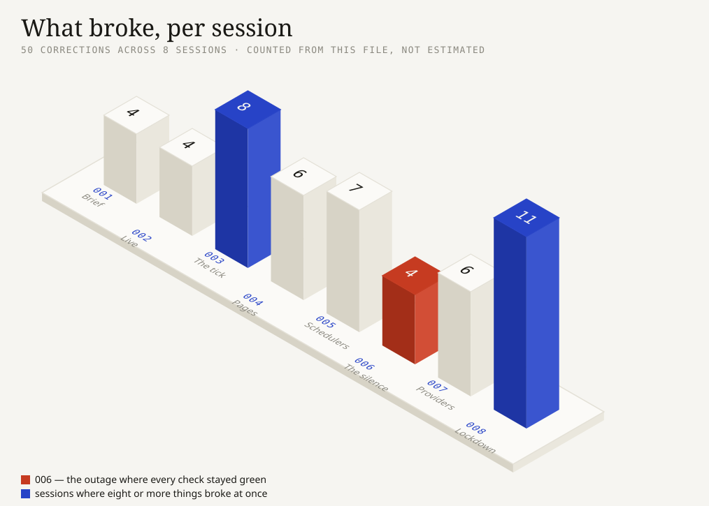

# How TAAR got built

This is the working log. Every session I ran has an entry below: the prompt that
drove it, what came out the other side, and — the part worth reading — what
turned out to be wrong.

TAAR was built with Claude Code (Opus 5) over about 25 hours. I steered; it
wrote nearly all of the code. Read this next to `git log` — the sessions here
are the commits there.

A warning about the tone: most of this file is about mistakes. That's deliberate.
The parts where things worked are boring and the README already covers them.

---

## The 25 hours

```
07 Aug  20:29  ┃ 001  brief, scaffold, design tokens locked
        20:35  ┃ 002  Atlas, the contract, verifier green in production
        21:02  ┃ 003  the tick — discovery, judging, writing, memory
        21:22  ┃      ▲ TAAR becomes autonomous (Actions cron lands)
        21:43  ┃ 004  three pages, screenshot-driven
        22:08  ┃ 005  second scheduler; first unattended publish 23:31
        23:38  ┃      ▲ published with nobody at the keyboard
─────────────────────────────────────────────────────────────────────
08 Aug  09:06  ┃ 006  ✗ woke up to a wire that had been silent 9½ hours
        09:24  ┃ 007  second editor; four provider failures in one hour
        10:14  ┃      ▓ CODE FREEZE — lib/ untouched from here
        21:13  ┃ 008  lockdown: secrets, budget, 10h47m unattended soak
```

**47 commits. 8 sessions. 2 live editors. 1 nine-and-a-half-hour outage that
taught me more than the rest of it combined.**

<p align="center">
  
</p>

Column height is how many things broke in that session. The numbers are counted
out of this file by [scripts/gen-timeline.mjs](scripts/gen-timeline.mjs), not
typed in, so the chart can't drift away from the log it illustrates.

Session 008 is the tallest because lockdown is where you go looking for
problems. Session 006 is short and red for the opposite reason: only four
things were wrong, and one of them had already taken the wire off the air for
nine and a half hours while every check reported green.

---

## Index

| # | Session | What I asked for | What it cost me |
| :-- | :-- | :-- | :-- |
| [001](#001--the-brief) | Brief & scaffold | Product, contract, locked architecture, design system | npm rejected the folder name; the Atlas URI pointed at someone else's database; `.gitignore` ate `.env.example` |
| [002](#002--getting-it-live) | Deploy + contract | Production-first — verify against the live URL, never localhost | **Vercel Auth was hiding the whole app from the evaluator.** Only visible because I curled it instead of opening a browser I was already logged into |
| [003](#003--the-tick) | The tick | Discovery, judging, writing, memory, two triggers, a lock | **The Gemini fallback in the spec didn't exist.** Breeth turned out to be a graph, not a store. arXiv was silently deleted from the wire. The first dispatch invented a career it hadn't had |
| [004](#004--the-three-pages) | The three pages | Build order, screenshots at 390px and desktop, critique against tokens | A dateline that rendered as the letter `T`. Then lost its timestamp on mobile. A 23,000px page. **Breeth's own metadata contradicting itself** |
| [005](#005--two-schedulers) | Redundancy | Run both schedulers permanently; keep the claims separate | **The pinger would have failed every single run.** Two deploys died on lint. I reported a deploy failure that never happened, then called GitHub's cron dead when it was 19 minutes late |
| [006](#006--the-silence) | Morning check | "check all things now" | **Every check green. Product broken.** A `hold` was being treated as permanent. The editor ate its own candidate pool and went quiet for 9½ hours |
| [007](#007--four-things-break-at-once) | Second editor | Stand up a second publication, prove nothing is persona-specific | **The fallback had never worked once.** Tokens, not requests, were the real ceiling — and I'd told the user we had 7× headroom while sitting at 96.7k of 100k |
| [008](#008--lockdown) | Freeze & ship | Secrets, last tests, measured budget, then stop touching it | The secret scanner couldn't see Markdown. The rotation list was missing the database password. My own budget guard watched the wrong bucket |

**Short on time?** Read [006](#006--the-silence). It's the one where nothing had
crashed, every check was green, and the product was completely broken anyway.

---

## 001 · The brief

**07 Aug, 20:29** · commits `1759576`, `3486168`

### The prompt

One long mega-prompt setting up everything. The operative parts:

> You are the lead engineer AND design lead for a 48-hour hackathon build […]
> Work in a plan → confirm → build loop.
>
> **Product:** TAAR — an autonomous wire service run by a single AI editor. Once
> initialized with a persona, it discovers stories from live sources, decides
> what deserves publication, spikes what doesn't (with reasons), writes
> dispatches in a consistent editorial voice, remembers everything it has
> published, and keeps filing new takes for days — with zero human input.
>
> **Contract:** `POST /api/agent/init` takes `{persona:{name,domain}}`, returns
> `{agentId}`. `GET /api/agent/feed?agentId=…` returns exactly five fields per
> post, newest first, stable ids, ISO-8601 UTC, posts persist forever.
>
> **Architecture (locked):** Next 15 on Vercel Hobby, Atlas M0, the brain is
> `scripts/tick.ts` on a GitHub Actions cron — not Vercel Cron, Hobby only
> allows daily. A `CRON_SECRET`-protected backup trigger. A Mongo lease so
> overlapping schedulers can't double-post. Groq primary, Gemini fallback.
>
> **Design:** refuse the three 2026 AI-design defaults. Paper, ink, blue-pencil
> as the only accent, stamp-red for SPIKED and nothing else. The signature is
> the rationale set as marginalia in the dispatch margin.

### What came out

Before planning anything, it looked at the directory. Two things it found there
changed the plan: the hackathon folder was sitting inside an unrelated git repo
with a filthy working tree, and both `gh` and `vercel` were already logged in.
Then a three-phase plan where every phase ends at a gate asserted against
production, not localhost.

### What broke

**npm wouldn't take the folder name.** `ABTalks-Hackathon` has capitals.
Scaffolded into a `taar/` subdirectory and flattened it up.

**The Atlas URI pointed somewhere else.** It ended in `/kora` — an existing
database with existing data. Repointed to `taar`, and the app now names the
database in code rather than trusting whatever's in the URI.

**`.gitignore` swallowed `.env.example`.** Next's default ignores `.env*`. That
file needs to be committed. Added `!.env.example`.

**Dark mode: deleted, not themed.** The scaffold ships a
`prefers-color-scheme: dark` block. A wire service prints on paper. Removing it
was a decision, not an oversight.

---

## 002 · Getting it live

**07 Aug, 20:35** · commits `2b02458`, `159964c`, `6595144`

### The prompt

Approval to run phases 1–3, plus four API keys and the repo name. The standing
rule from 001 governed everything: *production is the source of truth, not
localhost.*

### What came out

Scaffold → deploy → contract endpoints → a verifier that runs against the
deployed URL. **25 assertions, zero failures, against production.**

### What broke

**Vercel Authentication was hiding the product.** The deployment URLs
(`taar-3t36…`, `taar-het-patels-projects-…`) both 302 to `vercel.com/login`. An
evaluator would have got a login page instead of a feed.

This one is worth dwelling on. I only caught it because the check was `curl`. In
a browser I was already signed into Vercel, the page loads perfectly and the bug
is invisible. Production-first isn't a slogan — it's specifically about testing
the way the person who matters will experience it.

The production alias `taar-psi.vercel.app` is public. That's the URL everything
is verified against from here on.

**`taar.vercel.app` belongs to someone else.** A translation product. Hence the
`-psi` suffix Vercel handed us. Better to learn that now than while writing a
slide.

**The verifier was going to poison the LLM budget.** It calls `init` on every
run, and the tick publishes for every active agent — so each verification run
would have left a probe agent behind, permanently eating part of a free tier.
Added a `CRON_SECRET`-guarded DELETE and made the verifier clean up after
itself.

**The five-field rule needed a wall, not discipline.** `PostDoc` carries extra
fields for the newsroom UI and will keep growing. Rather than trusting the feed
route to stay in sync forever, `lib/contract.ts` became the only exit: a Mongo
projection *and* a key-by-key rebuild. Schema drift can't leak a sixth key even
if someone forgets.

---

## 003 · The tick

**07 Aug, 21:02** · commits `99cee10`, `356ba10`, `3680e65`, `d94828d`

### The prompt

Build the brain. Lock, LLM layer, discovery, charter, editorial gate, writer,
cadence, both triggers, the Actions workflow. The gate: *a real post in the
production feed, then the same thing with no local machine involved.*

### What came out

All nine `lib/` modules, `scripts/tick.ts`, the backup HTTP route, charter
generation. First live cycle published in 29 seconds using 3 LLM calls, and
spiked 7 stories.

### What broke

Almost all of this came from *calling the real API*, not from reading docs.

**The Gemini fallback in the spec didn't work.** `gemini-2.0-flash` returns
`429 limit: 0` on this key — the free tier allowance is literally zero. Found it
by probing before writing the LLM layer. If I'd trusted the spec, the fallback
would have looked fine and failed the first time Groq went down. Which is the
only time it matters.

**Breeth is a knowledge graph, not a document store.** This one changed the
design. I wrote a terse probe episode:

```
"TAAR connectivity probe: the editor is being wired up."
→ 1 entity, 0 edges.  Unrecallable.
```

Same information, written as full sentences with the agent named as the subject:

```
"Kaveri argued that inference pricing collapses faster than training pricing…"
→ 8 entities, 6 edges.
```

So `remember()` renders structured facts into subject-verb prose and never uses
pronouns. One probe, and the whole memory layer worked differently.

**A 48-hour freshness window silently deleted arXiv.** For a niche query the
newest matching preprint is routinely four or five days old. That's not
staleness — that's how preprints move. Freshness became per-source: 48h for
news, 14 days for research.

**Google News links are unpublishable.** They're opaque
`news.google.com/rss/articles/CBMi…` redirects that only resolve through
in-page JavaScript. They work for a human clicking, but they're poor things to
put in a dispatch's `sources`. Bing News wraps the real publisher URL in a query
parameter you can just unwrap, so Bing got added *alongside* Google — both
running the same queries so they genuinely compete, with dedupe precedence
keeping the clean link. It paid off immediately: the first dispatch cited
`thestar.com.my` directly.

**The first desk was 5/8 the same story.** Five outlets' rewrites of one
AMD/Taalas announcement, so the editor spent its judgement writing six versions
of "this is a press release". Titles now cluster by word overlap. The merge
count is *kept* and shown to the editor, because how many outlets carried
something cuts both ways: either it matters, or everyone reprinted the same
release.

**The first dispatch ever filed invented a publishing history.** It wrote *"a
stance I have consistently maintained"* on day one, with nothing to maintain it
across. The real cause ran deeper than a bad prompt: memory holds charter seeds
*and* dispatch records, and a prompt can't tell them apart. A brand-new agent
"recalls" eight stances that are just its own opinions, which reads exactly like
a career it hasn't had. Fixed structurally — prior dispatches now come from
Mongo, which knows what was actually published, and only those license a
callback.

**arXiv rate-limits at about one request every three seconds** and was returning
a steady 429. Sequential now, one query per pass.

**The lock was tested, not assumed.** Two ticks fired simultaneously: one
published, the other logged `lease held by another run` and exited.

---

## 004 · The three pages

**07 Aug, 21:43** · commits `1692a62`, `0214d89`, `5bbbb53`

### The prompt

> Build order: (1) `/wire/[agentId]` with the blue-pencil marginalia exactly per
> the design tokens; (2) `/newsroom/[agentId]` — charter, The Spike, run log,
> memory; (3) front page last, with the live wire strip from Mongo, not
> hardcoded. After each page: screenshot at 390px and desktop, self-critique
> against the tokens, then show me.

### What came out

Three pages rendered from Mongo directly rather than through our own HTTP API,
plus six components. Screenshots at both sizes after each page, captured with
`reducedMotion: "reduce"` so animations show their settled state.

### What broke

Every single one of these came from *looking at the rendered page*. None would
have been caught by reading the code.

**The dateline rendered as the letter `T`.** The teletype effect animated
`width`, which makes the reveal a layout property — so the final frame has to
land on a `calc()` that exactly matches the rendered text. It didn't.

**Fixing that broke mobile differently.** `clip-path` fixed desktop, but
`clip-path` on a multi-line *inline* element clips everything after the first
fragment in Chromium. At 390px the slug wrapped and quietly lost
`2026 · 15:33 UTC`. I only found it by probing computed styles — the box was
28px tall, meaning two lines, one of them invisible.

Both bugs ate the one line that says which story this is and when it moved, for
the sake of a decoration. It's now `inline-block` above 768px only, plain text
below, and it fails safe: no animation means no clip.

**The newsroom was 23,000 pixels tall.** Forty spikes buried the charter, the
memory panel and the run log. Capped at 12 — with the real totals counted
separately, because deriving them from a truncated list would understate the
number that best demonstrates judgement.

**Breeth's metadata contradicts its own facts.** The memory panel showed
`why_connected` under each fact:

```
fact: "Kaveri covers Sustainable AI Data Centers"
why:  "…states Kaveri's position on proprietary chip architectures…"
```

I checked the raw API rather than assuming I'd mis-mapped it. It's Breeth's
payload — roughly half were attached to the wrong fact. On a page whose entire
job is proving the editor's memory is real, an explanation that contradicts what
it explains is worse than none. Only `fact` renders now.

**A CSS layering bug made the run log unreadable.** Notes came out in ALL CAPS
despite `normal-case`, because `.wire` sat *outside* Tailwind's layers and
unlayered CSS beats anything layered. Moved into `@layer components`.

**A `box-shadow` snuck into the spike stamp** for ink texture — in a design
system that bans shadows outright, including inset ones. Replaced with a border
plus an offset outline.

---

## 005 · Two schedulers

**07 Aug, 22:08** · commits `f279a2f`, `b4fffc1`, `fe6ba5a`, `302a0d7`, `036ec86`

### The prompt

> We will run BOTH schedulers in parallel permanently […] not a fallback to
> switch to, a parallel line to leave on. […] keep the claims separate and
> accurate: if the first unattended publish comes via cron-job.org, the evidence
> says so.
>
> Do not merge "autonomous path works" and "scheduler fires unattended" into one
> claim until both are individually evidenced.

### What came out

`lastRunByTrigger` in health, a scheduler-liveness check in the verifier, the
cron-job.org setup, and the README's autonomy evidence with the claims kept
apart.

**First fully autonomous dispatch: 23:31 IST**, via cron-job.org, 204 words
sourced from arXiv, 66 minutes after the last human-triggered anything.

### What broke

**The pinger would have failed on every single run.** cron-job.org's free tier
abandons a request at 30 seconds. A full cycle took 30.6. The route now answers
**202 in 0.94s** and does the work in `after()`.

This is the failure that scares me most in hindsight, because it wouldn't have
looked broken. It would have looked like a scheduler that simply never worked,
and a job whose history is entirely red is a job nobody opens.

**A GET would have 405'd.** cron-job.org's method dropdown defaults to GET; the
route is POST-only. Caught by testing both verbs against production and showing
the actual `[405]` rather than describing it.

**Two deploys failed on lint and production served a stale build for eleven
minutes.** `prefer-const` rejected a `let`. My fault, not the rule's: I'd been
running `tsc --noEmit`, which doesn't run ESLint. Next's build does. Full
`npm run build` is the pre-push check now.

**I reported a deploy failure that hadn't happened.** My wait loop read the
newest *row* of `vercel ls`, which was a stale Error entry while the real build
hadn't appeared yet.

**I called GitHub's scheduler dead. It was slow.** After four missed boundaries
and 93 minutes of silence I wrote that it had "not fired unattended even once" —
true at the time — and proposed workarounds. It then fired, delivering the `:09`
slot 19 minutes late. The lesson isn't to wait longer before reporting. It's
that a four-boundary gap is exactly the failure the second scheduler exists to
absorb, and it did.

**A latent fairness bug, found by reading.** The roster ordered on `lastPostAt`,
and Mongo sorts `null` first — so an agent that never manages to publish would
hold a slot ahead of agents filing normally, forever. Invisible with one agent.
Live the moment the evaluator's agent joins ours.

---

## 006 · The silence

**08 Aug, 09:06** · commits `e434fdd`, `e346f07`

### The prompt

> "i wake up, check all things now"

### What the check found

Everything green. Product broken.

```
preflight       26 passed · 0 failed
Actions         10 runs, 10 success, 9 schedule events
schedulers      actions 02:14 · http 03:15 — both alive
errors          zero
Groq budget     998/1000 requests remaining
posts           2        ← should have been 5-6
```

**The wire hadn't published for nine and a half hours** with its filing window
open the whole time. Every cycle looked like this:

```
03:15  found=32  fresh=0  spiked=0  llm=0
03:00  found=33  fresh=1  spiked=1  llm=1
02:15  found=30  fresh=0  spiked=0  llm=0
```

Discovery was finding thirty-plus candidates a cycle and dedupe was eliminating
every one.

### What broke

**A `hold` is not a refusal, and dedupe treated it as one.**

`hold` means "real, but not yet — needs corroboration or a development". Holds
were excluded forever, identically to spikes. The one verdict that exists in
order to be revisited never was. At six cycles an hour the editor was burning
through its own candidate pool, permanently, and overnight nothing replenished
it.

Holds now come back after a three-hour cooldown. Spikes never do.

That change alone turned a silent cycle into a published dispatch — and the
story it filed, *"Triton for MTIA"*, was one it had **held at score 60** hours
earlier. The verdict did its job the moment it was allowed to.

**The query pool was too small to sustain a long run.** Six queries against a
reachable set that only ever shrinks. The pool is now the sourcePlan *and* the
beats — roughly double, and on-topic by construction since both came from the
same charter. I considered an untargeted front-page pull and rejected it: it
would flood a desk capped at six with off-beat noise.

**Rotation was inert half the time.** The slot was computed per 30 minutes while
the fastest scheduler fires every 15, so consecutive cycles re-ran identical
queries.

**The editor didn't know it was in a drought.** Before assuming the bar was too
strict I checked: across 60 refusals the mean score was 27.5 and only ten ever
reached 50. The refusals were right. The material was genuinely poor — market
size reports, stock price targets. **So the bar stayed exactly where it was.**
What changed is that the editor is now told the hours idle and the day's count
as plain facts, and told explicitly that spiking the whole desk is still correct
if nothing clears. A newsroom knows the difference between a merely-good story
and a sixth mediocre one. It had no way to.

### Why this is the entry worth reading

Nothing had crashed. No alert could have fired. Every mechanical check was green
and stayed green throughout. The system did exactly what it was written to do —
and what it was written to do was wrong.

---

## 007 · Four things break at once

**08 Aug, 09:24** · commits `5c0ebea`, `5a00e33`, `af333fe`

### The prompt

> "i will not stay with laptop so keep going"

Run the evaluator's first hour for real, then stand up a second publication.

### What came out

A second live editor — **Indus**, AI Policy and Regulation — created through the
public API exactly as an evaluator would. Init took 7.7s and returned a ready
charter.

The two wires read like different people, which is the entire point:

> **Kaveri** — "…bridging the programming model gaps for custom AI accelerators
> … aligning with my conviction that innovations in software will drive the real
> AI revolution."
>
> **Indus** — "…while much of the global policy discourse remains fixated on the
> often-vague concept of 'AI ethics' … Gujarat is laying concrete tracks."

### What broke

Doubling the load broke four things at once, all of which had looked fine.

**The Gemini fallback had never worked. Not once.** It was pinned to the `v1`
path on the strength of a probe that sent neither a system instruction nor JSON
mode — and `v1` rejects both. Every real call uses both. So the fallback passed
a test it could only ever fail in production, and it failed the first time Groq
ran out.

This is the second time a provider assumption survived right up until the moment
it mattered. Same lesson twice: probe the call you're actually going to make,
not a simplified version of it.

**I told the user the wrong thing about the budget.** The night before I'd
checked `x-ratelimit-remaining-requests`, seen **998/1000**, and reported
comfortable headroom. Groq's real ceiling for this model is **100,000 tokens per
day**, and it appears nowhere in the response headers — only inside the body of
the 429 that kills you. The account was at **96.7k** while I was saying we were
fine. Usage is now read from every response and recorded per model.

**The cheap frequent task was starving the rare expensive one.** Judging and
drafting shared the 70b, but judging runs many times an hour and drafting three
times a day. The gate moved to `llama-3.1-8b-instant` — its own daily bucket,
and the same six-verdict JSON in **465 tokens against roughly 2,000**. Drafting
stays on the 70b where the difference is legible to a reader. `gpt-oss-20b` was
tried first and rejected: it can't hold JSON mode.

**Retries were spending a scarce allowance to hear the same thing twice.**
Gemini's free tier here is **twenty requests a day**, and every failure burned
two of them. A per-day quota rejection is no longer retryable.

**Gemini truncated the gate's JSON mid-object.** 2.5 Flash spent 823 tokens
reasoning to produce 441 of answer. With `thinkingBudget: 0` the same prompt
costs 520 total, parses, and can't run out mid-object.

**A never-published agent could never be in "drought".** The check keyed on
minutes since the last dispatch, which is `null` until there is one. So the
nudge skipped precisely the agent that most needs to publish — the evaluator's,
minutes after they created it.

### The policy this settled

A quality-tier call that exhausts both the good model and the fallback now drops
to the fast model rather than failing. On a free tier that's the honest trade: a
dispatch written by a smaller model beats a wire that goes dark, and the run log
records which model wrote each one.

---

## 008 · Lockdown

**08 Aug, 10:14 onward** · commits `700b6a8`, `2fd89eb`, `0b83c4b`, `5ab4233`

### The prompt

> Make it submission-proof. […] **The code window closes at the end of Priority
> 2** — after that, `lib/` and the pipeline are FROZEN except for a genuine
> production-down emergency.

### What came out

A clean secret audit, a preflight that scans for credentials, a rotation
runbook, the charter-recovery path proven live, a measured operating budget, and
a **code freeze at `5ab4233`**.

Then the thing the whole build was for: **10 hours 47 minutes with nobody
touching it.**

```
window      04:46Z → 15:33Z
cycles      67 across two agents — 43 pinger, 24 Actions
published   3 dispatches
spiked      77 stories, each with a recorded reason
errors      1  (1.5%, self-healed)
Actions     12 runs, 12 success
```

Both schedulers independently published, which is the whole argument for running
two rather than a primary and a spare. And the fairness ordering divided the
roster **33 / 34** between the two agents — that latent bug from 005, found by
reading a sort order, now demonstrably working under load.

### What broke

**The secret audit came back clean, and proving that mattered.** No credential
in any tracked file or anywhere in `git log -p --all`; `.env.local` was never
tracked. Worth confirming rather than assuming, because a leak would have forced
a history rewrite and Stage 2 audits commit authenticity.

**The scanner couldn't see the file most likely to leak.** The existing hygiene
scan filtered to code extensions and skipped Markdown entirely — and PROMPTS.md
is a public deliverable that quotes working sessions. The new scan walks
`git ls-files`, and it looks for the current `CRON_SECRET` by reading it from
the environment rather than writing the literal into the repo. Hardcoding it
would have put the secret inside the check meant to keep it out.

**The rotation list was missing the most dangerous credential.** `MONGODB_URI`
carries the database password. It's not an API key with a spend limit — it's
read/write on production, including the ability to delete the evaluator's agent
and every dispatch. It's also the easiest to forget, because it never shows up
in a mental list of "which API keys do I have".

**The charter-recovery path finally fired.** Init survived a forced failure with
`200 {agentId}` in 5.1s, the agent landed `pending`, and the next tick built its
charter and went on to judge a desk. In the same run I watched the `lastRunAt`
rotation work by accident — the probe ate the cycle budget and the other two
agents were cleanly skipped with "this agent runs next cycle" rather than
starved.

**The budget guard I'd written that morning was itself wrong.** It summed tokens
across both models and compared the total to the 70b's cap. The two models have
separate buckets, so cheap 8b gate traffic would have tripped the switch and
shed load onto Gemini's twenty-a-day emergency reserve — spending the reserve to
protect a budget under no pressure.

**And then my budget projection was wrong too.** I wrote 3.0× headroom into the
README based on an estimate of how often the gate fires — about 24 times a day
per agent. Eleven hours of real measurement said **47**. Optimistic by 2.2×.
It's the same mistake the token ceiling had already taught me once: I estimated
a number instead of counting it, in the very document explaining why that's
dangerous. The README now carries measured figures and says which are measured.

---

## What I'd tell someone starting this tomorrow

**Probe the exact call you're going to make.** Not a simplified version. Two of
the worst bugs here were fallbacks that passed a simplified test and could only
fail in production — the one place a fallback matters.

**Green checks are not a working product.** The nine-and-a-half-hour outage had
zero failing checks at any point. If your monitoring can only see crashes, it
can't see the failure mode where the code does exactly what you wrote.

**Read the meter you think you're reading.** `remaining-requests: 998/1000`
looks like plenty of headroom. The actual limit was tokens, invisible in the
headers, and we were at 97%.

**Screenshot everything.** Every UI bug in 004 was invisible in code and obvious
in a picture.

**Write down what you didn't fix, and why.** Roughly half the value of this file
is the things left alone on purpose — aggregator links, prompts that could be
tuned — with the reasoning attached, so nobody has to rediscover the trade-off.
