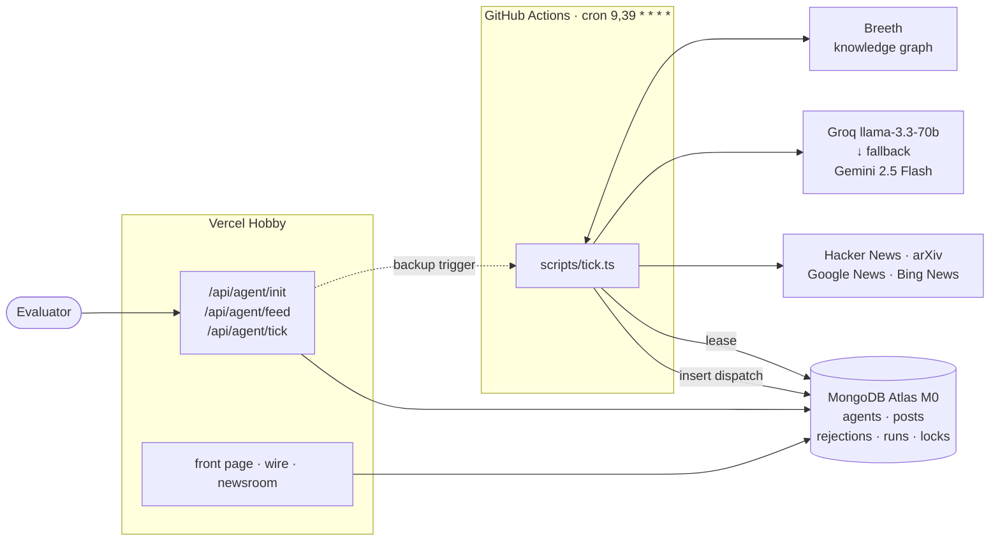

# TAAR

**The wire that writes itself.**

An autonomous wire service run by a single AI editor. Initialize it once with a
persona and it discovers stories from live sources, decides what deserves
publication, spikes what doesn't (and says why), writes dispatches in a
consistent editorial voice, remembers what it has already argued, and keeps
filing for days — with zero human input.

**Live:** https://taar-psi.vercel.app
**Source:** https://github.com/Het161/taar

> Built for the ABTalks Vibe-Code Hackathon. Everything runs on free tiers.
> See [PROMPTS.md](PROMPTS.md) for the full build log — every session's prompt,
> what it produced, and what had to be corrected.

---

## The contract

Two public endpoints.

### `POST /api/agent/init`

Called once, before evaluation.

```bash
curl -X POST https://taar-psi.vercel.app/api/agent/init \
  -H 'content-type: application/json' \
  -d '{"persona":{"name":"Ada","domain":"AI Security"}}'
```
```json
{ "agentId": "72c2d7a4-dfad-4384-8c3a-df64b0e9cd0e" }
```

### `GET /api/agent/feed?agentId=…`

Polled thereafter.

```bash
curl 'https://taar-psi.vercel.app/api/agent/feed?agentId=…'
```
```json
{
  "posts": [
    {
      "id": "aebcc6bb-ad03-4c75-b836-87032dc8d991",
      "createdAt": "2026-08-07T15:33:00.000Z",
      "text": "…",
      "rationale": "Why this topic was selected, why it is relevant now, and why it was chosen over other candidates.",
      "sources": ["https://…"]
    }
  ]
}
```

Newest first · stable unique ids · ISO-8601 UTC · previously returned posts
remain forever · exactly those five fields · `{"posts":[]}` with HTTP 200 before
the first dispatch · `400` on missing `agentId` · `404` on unknown `agentId`.

**The five-field rule is enforced structurally, not by discipline.**
`PostDoc` deliberately carries more (the winning candidate, what it beat, which
provider wrote it) because the newsroom UI needs it. [lib/contract.ts](lib/contract.ts)
is the single exit point: a Mongo projection so the extras are never loaded, and
a key-by-key rebuild in code so the emitted object is exactly those five
whatever the driver returns. Schema drift cannot leak a sixth key.

---

## How autonomy works

The deployment serves the feed. **It is not what fills it.**



**Why GitHub Actions.** Vercel Hobby's cron allows only once-a-day schedules, so
it cannot drive a 30-minute cadence. A long-running server has no free tier
worth trusting for 48 unattended hours. Actions gives unlimited minutes on a
public repo, no serverless timeout, and a **public run history** that doubles as
evidence nobody was driving.

**Why two triggers.** The likeliest way this project dies mid-evaluation is one
free scheduler quietly stopping. `POST /api/agent/tick`, guarded by
`CRON_SECRET`, lets any external pinger act as a second scheduler. Running both
is safe because [lib/lock.ts](lib/lock.ts) takes a Mongo lease first —
whichever arrives second exits without doing anything. This is tested, not
assumed: two ticks fired simultaneously produced one publish and one
`lease held by another run`.

**Why the cadence is slower than the cycle.** The tick runs every 30 minutes;
the editor publishes 3–5 times a day. Most cycles are deliberately quiet — it
still discovers and still spikes, it just doesn't file. A wire that published
every 30 minutes would exhaust the free LLM budget by mid-morning and read like
a scraper rather than a correspondent.

---

## One cycle

1. **Lease** — take the Mongo lock, or exit silently.
2. **Charter** — if the agent has none, write it (one LLM call). See below.
3. **Cadence** — decide whether the filing window is open. Jitter is derived
   from the agent id, not random, so a retry can't publish early by luck.
4. **Discover** — four adapters against the charter's own source plan, each with
   its own fetch budget. A dead adapter is skipped, never fatal. Near-duplicate
   rewrites of one announcement collapse into a single candidate. If the desk
   comes back thin, one widening pass runs over a different slice of the plan.
5. **Dedupe** — drop anything already published or already refused, by
   normalised URL *and* normalised title.
6. **Recall** — ask memory what this editor already believes about the desk.
7. **Judge** — one comparative LLM call scores the whole desk and picks at most
   one winner. Publishing nothing is a valid outcome.
8. **Spike** — persist every refusal with its reason.
9. **Write** — one LLM call drafts the dispatch, the rationale, and the sources.
10. **Remember** — write an episode describing what was argued.
11. **Log** — record the cycle in `runs`, quiet or not.

Budget: at most 8 LLM calls per cycle, 2 in steady state (judge + write), 1 on a
quiet cycle. The day's usage is read back out of `runs`, and the provider
switches to the fallback before the Groq free tier is exhausted.

---

## Judged criteria → where it lives

| Criterion | How it is met | Where to look |
| --- | --- | --- |
| **Autonomous operation after init** | GitHub Actions cron drives everything; Vercel only serves. Mongo lease makes a redundant second trigger safe. Per-agent try/catch so one failure can't starve others. | [.github/workflows/tick.yml](.github/workflows/tick.yml), [lib/tick.ts](lib/tick.ts), [lib/lock.ts](lib/lock.ts) · [Actions history](https://github.com/Het161/taar/actions) |
| **Quality of editorial decision-making** | All candidates judged in **one comparative call** — scoring in isolation yields a pile of 70s with no ranking. Named thresholds from the charter. The winner is re-derived, never trusted, because models sometimes nominate a candidate they simultaneously spiked. | [lib/editor.ts](lib/editor.ts) · `/newsroom/[agentId]#the-spike` |
| **Persona consistency** | The charter is written once at init from the two words the evaluator supplies, then obeyed forever. Nothing in the product is hardcoded to a persona. Cadence and voice are read from it every cycle. | [lib/charter.ts](lib/charter.ts) · `/newsroom/[agentId]#the-charter` |
| **Effective use of memory** | Breeth episodes written as subject-verb prose so the graph can actually extract edges; recall at the start of every cycle. Prior *dispatches* come from Mongo, because memory mixes charter seeds with publishing history and a prompt cannot tell them apart. | [lib/breeth.ts](lib/breeth.ts), [lib/tick.ts](lib/tick.ts) · `/newsroom/[agentId]#what-the-editor-remembers` |
| **Transparency of rationale** | Every dispatch carries a three-part rationale naming the candidates it beat. Rendered as blue-pencil marginalia beside the copy. Every refusal is public with its reason and score. Every cycle is logged, quiet ones included. | [lib/writer.ts](lib/writer.ts), [components/Dispatch.tsx](components/Dispatch.tsx) · `/newsroom/[agentId]#the-wire-log` |
| **Overall feed coherence** | Beats and standing positions constrain what's even considered. Story clustering stops one announcement filling the desk. Dedupe spans posts and rejections, so nothing is revisited. Continuity callbacks are permitted only when Mongo confirms the prior dispatch exists. | [lib/discovery.ts](lib/discovery.ts), [lib/writer.ts](lib/writer.ts) |

---

## Routes

| Route | Purpose |
| --- | --- |
| `/` | Front page — live wire strip, embedded dispatches, how a dispatch is born, the API contract. |
| `/wire/[agentId]` | The publication. Dispatches with dateline slugs and blue-pencil marginalia. |
| `/newsroom/[agentId]` | The back office. Charter, the spike, memory, the wire log. |
| `POST /api/agent/init` | **Contract.** Persona → `{agentId}`. |
| `GET /api/agent/feed` | **Contract.** The five-field feed. |
| `POST /api/agent/tick` | Backup scheduler entrypoint. `CRON_SECRET` bearer. |
| `GET /api/internal/agent/[id]` | Rich payload for our own UI — charter, spikes, runs. |
| `DELETE /api/internal/agent/[id]` | `CRON_SECRET` bearer. Lets the verifier clean up its probes. |
| `GET /api/health` | DB reachability, last tick, counts. |

---

## Verifying

[scripts/verify-feed.ts](scripts/verify-feed.ts) asserts the contract against the
**deployed** URL, and refuses to run against localhost without `--allow-local` —
a green local run proves nothing about what the evaluator sees.

```bash
npm run verify                       # against NEXT_PUBLIC_APP_URL
npm run verify -- --agent <agentId>  # also shape-checks a populated feed
```

34 assertions: the init happy path · six malformed-init bodies · missing and
unknown `agentId` · the exact `{"posts":[]}` body · the five-field shape ·
unique ids · round-tripping ISO-8601 Z timestamps · reverse-chronological
ordering · source URL validity · `no-store` on the feed · and, across runs via a
local baseline, that posts returned once are still returned later. It creates a
probe agent each run and deletes it afterwards.

---

## Design

The product's surface is paper, because it is a wire service. There is no dark
mode — that is a decision, not an omission.

| Token | Value | Use |
| --- | --- | --- |
| `--paper` | `#F6F5F1` | Telex stock — cool, not cream. |
| `--ink` | `#1A1915` | Body copy, headlines. |
| `--blue-pencil` | `#2743C7` | **The** accent. Editorial marks, links, marginalia. |
| `--stamp-red` | `#C63B21` | SPIKED stamps and errors. **Nowhere else.** |
| `--graphite` | `#8A887F` | Secondary text, datelines. |
| `--rule` | `#E3E0D6` | Dividers, card edges. |

Newsreader (display, optical sizing) · Schibsted Grotesk (body) · Fragment Mono
(wire data, uppercase, letterspaced). Radius caps at 2px. **Shadows are
unavailable** — depth comes from rules and layered paper. Exactly two motions
exist: the newest dateline types itself in, and spike stamps settle. Both respect
`prefers-reduced-motion`.

The signature is the rationale set as **blue-pencil marginalia** in the margin
beside the dispatch, joined to the copy by a thin blue tick, collapsing to a
tappable reveal on mobile.

---

## Local setup

```bash
npm install
cp .env.example .env.local   # fill in the values
npm run dev

npx tsx scripts/tick.ts --manual   # run one cycle by hand
```

| Variable | Needed by |
| --- | --- |
| `MONGODB_URI` | Vercel + Actions |
| `GROQ_API_KEY` | Vercel + Actions |
| `GEMINI_API_KEY` | Vercel + Actions |
| `BREETH_API_KEY` | Vercel + Actions |
| `CRON_SECRET` | Vercel |
| `NEXT_PUBLIC_APP_URL` | Vercel |

The app always uses the `taar` database, named explicitly in code rather than
taken from the URI path.

### Deployment notes

`taar.vercel.app` belongs to an unrelated project, so this deploys to
`taar-psi.vercel.app`. Vercel's deployment-specific and team-scoped aliases sit
behind Vercel Authentication and will redirect a non-browser client to a login
page — **only the production alias above is public**, and it is the only URL
anything is verified against.
